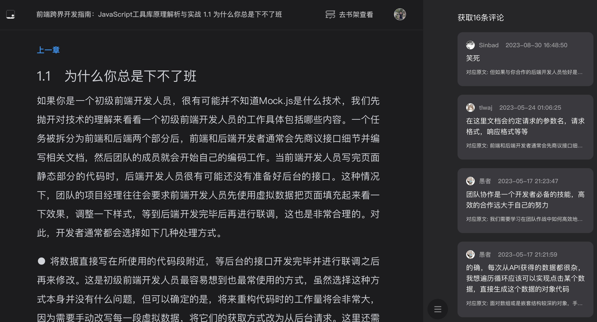
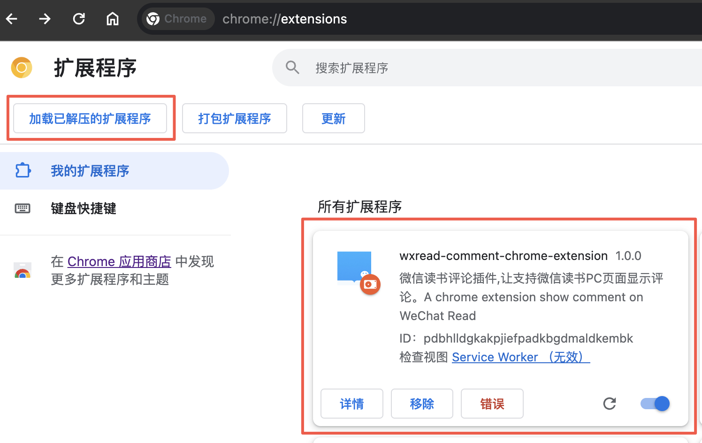

# 微信读书评论插件-适用于PC浏览器
A chrome extension show comments for weread.qq.com  
一个让网页微信读书页面显示评论的插件，了解他人的见解，解答阅读中的困惑, 不做一个孤独的阅读者。

目前已发布到插件商店,可以直接安装
- [Chrome插件商店](https://chromewebstore.google.com/detail/kfjimgaoegibikoojcbnkbffkongnoep)
- [Edge插件商店](https://microsoftedge.microsoft.com/addons/detail/%E5%BE%AE%E4%BF%A1%E8%AF%BB%E4%B9%A6%E8%AF%84%E8%AE%BA%E6%8F%92%E4%BB%B6/dpihhfdnbndfhonhkbnnhojbnaeedabc)

## 效果预览
请求微信评论接口数据，侧边栏渲染评论数据，支持评论引用原文的展开和收起

## 使用方法
<ol>
    <li>
        方法一: <a href="https://chromewebstore.google.com/detail/kfjimgaoegibikoojcbnkbffkongnoep">Chrome应用商店安装</a>
    </li>
    <li>方法二: <a href="https://github.com/my19940202/wx-read-comment-extension/raw/main/微信读书评论-2024-05-14.zip">手动下载插件</a> 再打开chrome://extensions/&nbsp; 页面导入安装插件</li>
</ol>

## 功能规划
1. 界面交互优化
2. 支持评论排序
3. 支持点赞 发表评论等

## 产品改进建议沟通

## 赞助

