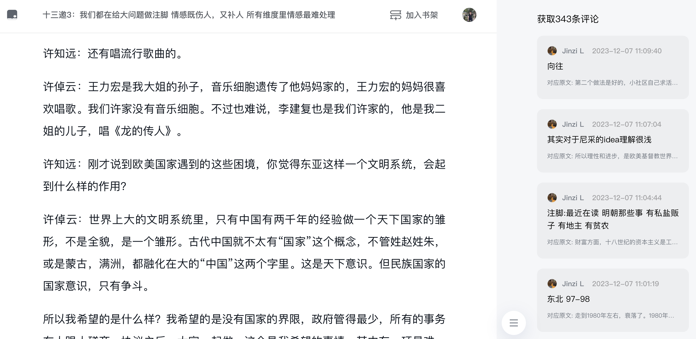

# PC微信读书评论插件
支持浏览器场景访问微信读书页面时，加载和显示读书评论，提升阅读体验。

## 一期: 2023-12~2024-01
请求微信评论接口数据，侧边栏渲染评论数据，支持评论引用原文的展开和收起

使用方法: 
<ol>
    <li>
        下载<a href="https://github.com/my19940202/wx-read-comment-extension/raw/main/微信读书评论-1.0.0.zip">微信读书评论-1.0.0.zip</a>
    </li>
    <li>在&nbsp;chrome://extensions/&nbsp; 页面导入安装插件</li>
</ol>

## 二期:  2024-04~now
1. 评论排序
2. 显示评论的回复
3. 支持点赞和发表评论

## 产品改进建议沟通

